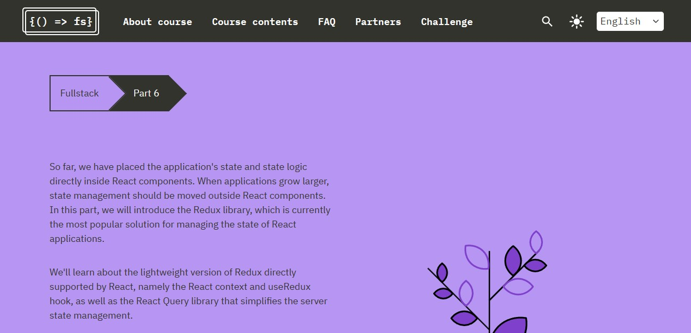

# My React Learning Journey Full-Stack OPEN PART-6

In this enlightening journey through the world of React, I've gained invaluable knowledge and skills. 

## Redux Library
I've delved into the Redux library, a powerful tool that has transformed the way I manage the state of my React applications. It's like having a personal assistant that takes care of all the state and state logic, leaving my React components clean, predictable, and testable.

## React Context and useRedux Hook
I've also discovered the magic of React's built-in features - the Context and useRedux hook. It's like having a mini Redux right within React! These features have allowed me to create a global state and access it from any component in my application, making data sharing a breeze.

## React Query Library
Last but not least, I've explored the React Query library. This gem has simplified server state management in ways I never thought possible. Fetching, caching, and updating data from the server has never been easier. It's like having a personal courier that takes care of all the server communications, leaving me free to focus on what I do best - creating amazing user experiences.

This journey has not only equipped me with new tools but also opened my eyes to the endless possibilities in the world of React. I can't wait to apply these learnings in my future projects and see where this journey takes me next!

